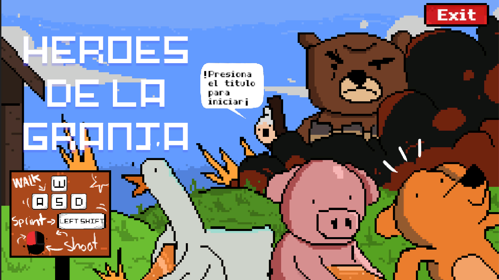
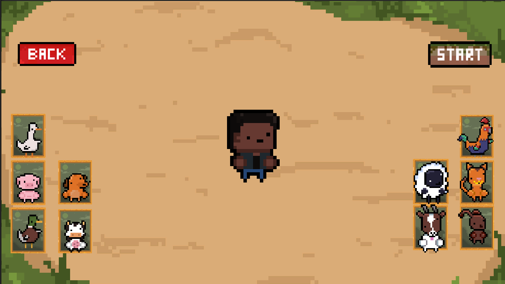
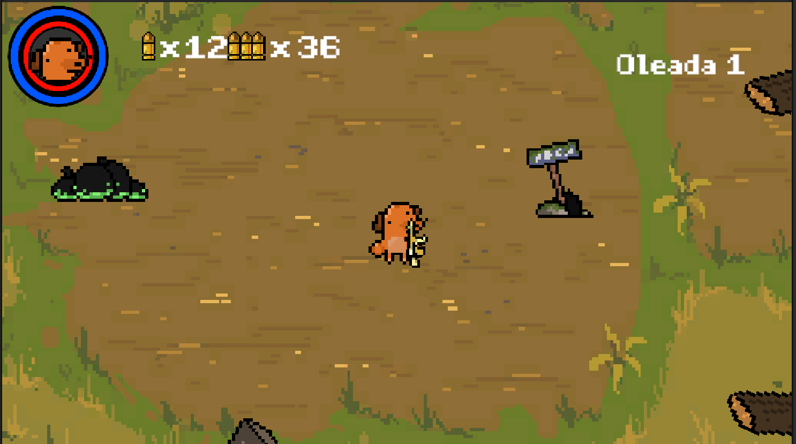
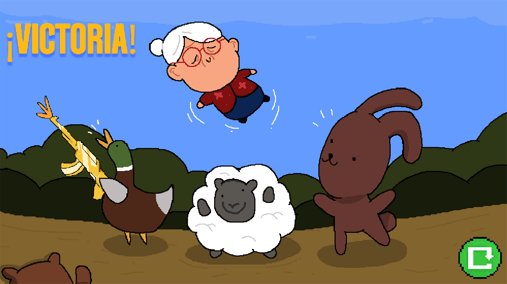
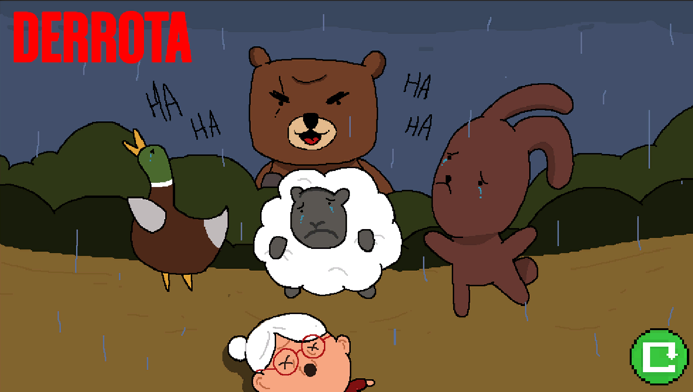

# Heroes de la Granja

Heroes de la granja es un videojuego 2D vista Eagle View las historia del juego se basa en que los animales del bosque han secuestrado al cuidadora de la granja (una dulce ancianita) los animales de la granja deciden salvarla por lo que toman el armamento del difunto esposo de la cuidadora para embarcarse en una aventura donde mataran a todos los animales del bosque si es necesario para salvar a su cuidadora.

##  Características

-  Enemigos con IA simple
-  Sistema de oleadas limitadas
-  Gráficos estilo pixel art
-  Combate contra animales del bosque con un toque humoristico

##  Tecnologías utilizadas

- Unity 2D
- C#
- Aseprite

## Capturas de pantalla

<p align="center">
  
  
  
  
  
  
</p>

##  Cómo ejecutar el proyecto

1. Clona el repositorio:
```bash
git clone https://github.com/usuario/nombre-del-repo.git
https://github.com/CheeseBread5/Heroes-Granja/tree/5bd71808fff20a00d8e41bdd0c920bbdf7a0fc46

